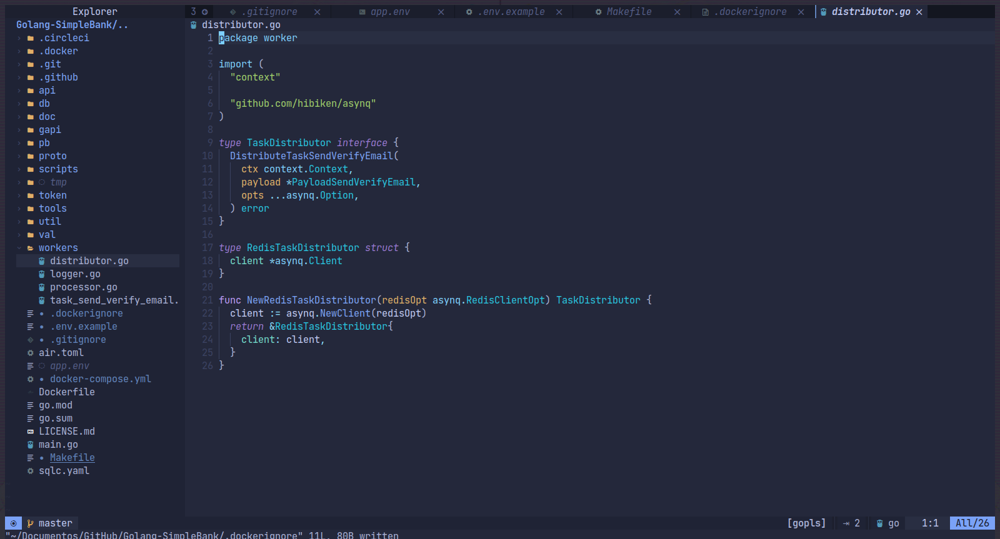

<p align="center">
  <a href="#" target="blank"></a>
</p>

<p align="center">
  <a href="#-tecnologias">Tecnologias</a>&nbsp;&nbsp;&nbsp;|&nbsp;&nbsp;&nbsp;
  <a href="#-projeto">Projeto</a>&nbsp;&nbsp;&nbsp;|&nbsp;&nbsp;&nbsp;
  <a href="#-como-executar">Como executar</a>&nbsp;&nbsp;&nbsp;|&nbsp;&nbsp;&nbsp;
  <a href="#-licença">Licença</a>
</p>

<p align="center">

  

</p>

<br>

<a id="-tecnologias"></a>

## ✨ Tecnologias

Esse projeto foi desenvolvido com as seguintes tecnologias:


<a id="-projeto"></a>

<p align="center">

  

</p>

## 💻 Projeto

Esse projeto é uma Master Class do que eu aprendi ao longo do tempo construindo com Golang, seguindo conceitos de arquitetura de software como DDD e TDD, conhecimentos de Docker aplicado em múltiplos containers, CI e CD com Github Actions e CircleCI e outros tópicos.

Neste processo de construção da aplicação, eu aprendi o passo a passo de como projetar, desenvolver e implantar um serviço web de back-end do zero. Acredito que a melhor maneira de aprender a programar é construindo um aplicativo real. Portanto, ao longo do tempo, decidi colocar a escolha de construir um simulado simples de banco. O app como todo oferece:

- Criar e gerenciar contas bancárias.
- Registrar todas as alterações de saldo em cada uma das contas.
- Realizar uma transferência de dinheiro entre 2 contas.

<br>

## 🏔️ O que essa aplicação consiste?

Primeiro, é possível observar a presença de um servidor HTTP RESTful usando Gin - um dos frameworks Golang mais populares para construir serviços web. O servidor Gin consegue manusear tanto rotas, cors, conectar com o banco de dados para resgatar dados solicitados, lidar com erros, autenticar usuários e proteger as APIs com tokens de acesso JWT e PASETO.

Enquanto isso, há uma segunda camada de criação de APIs, essa sendo formada por um servidor gRPC, uma acoplação de um gateway gRPC para atender gRPC e HTTP com 1 única implementação, incorporação de uma documentação Swagger gerada automaticamente, execução de trabalhadores assíncronos, loggers de serviços e etc. Contendo as mesmas regras de validações, uso de banco de dados, um serviço de fundo com a utilização do Redis, uso de um proxy reverso para conectar ambas as API no serviço nomeado Traefik e testes automatizados.

<br/>

<a id="-como-executar"></a>

## 🚀 Como executar

### 💻 Pré-requisitos

Antes de começar, verifique se você atendeu aos seguintes requisitos:

- Você instalou a versão mais recente de `< Docker & Python>`

- Você tem uma máquina `< Windows / Linux / Mac >`.

- Você possui um `< Editor de código ou IDE / Gerenciador de banco de dados >`.

Aplicações que recomendo utilizar para a aplicação como um todo:

    - Insomnia ( Realizar Requisições HTTP )
    - Evans (Ferramenta CLI para trabalhar com servidor gRPC)

O container docker por padrão já irá subir o pgAdmin para manuseio do banco de dados!

## ☕ Pequena ajuda

Preencha o arquivo `.env.example` com as informações cobradas e depois renomeie para `.env`.

```env
# Postgres Live
DB_HOST=db
DB_USER=
DB_PASSWORD=
DB_NAME=
DB_PORT=5433
DB_DRIVER=postgres

DB_SOURCE=postgresql://${DB_USER}:${DB_PASSWORD}@${DB_HOST}:${DB_PORT}/${DB_NAME}?sslmode=disable

MIGRATION_URL=file://db/migrations

# Postgres Database for tests, DO NOT CHANGE
DB_USER_TEST=db_test_user
DB_PASSWORD_TEST=db_test_password
DB_NAME_TEST=db_test_database
DB_HOST_TEST=127.0.0.1

# Used by pgadmin service
PGADMIN_DEFAULT_EMAIL=
PGADMIN_DEFAULT_PASSWORD=

# on backend service
HTTP_SERVER_ADDRESS=0.0.0.0:8080
GIN_SERVER_ADDRESS=0.0.0.0:9090
GRPC_SERVER_ADDRESS=0.0.0.0:5454

# 32 chars
TOKEN_SYMMETRIC_KEY=
ACCESS_TOKEN_DURATION=
REFRESH_TOKEN_DURATION=
ENVIRONMENT=development
REDIS_HOST=redis:6397

```

### Se lembre de ter o Docker rodando :ocean:

E então, rode o comando `docker-compose up --build -V`.

Agora você pode acessar [localhost:8080](localhost:8080) do seu navegador. Esse é o serviço do traefik, que fará você ser redirecionado para o dashboard do serviço, te permitindo o acesso de ambas as aplicações, tanto a documentação swagger quanto os servidores HTTP e gRPC.

<a id="licença"></a>

## 📄 Licença

Esse projeto está sob a licença MIT. Veja o arquivo [LICENSE](../LICENSE.md) para mais detalhes.

---

#### _Sinta-se livre para colaborar, toda ajuda é bem vinda ;)_
